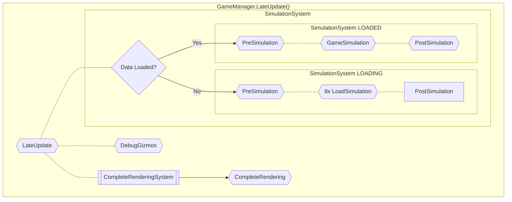

### Lane Connection structure

 - Owner (original SubLane entity)
 - Lane component (connection description in for of PathNode set (Start, Middle, End))


### Tool Interaction modifiers

 - None - create/modify regular connection, auto mode (connect matching shared lane vehicle types)
 - Alt - create/modify unsafe connection
 - Ctrl - track-only connection for mixed lanes
 - Shift - road-only connection for mixed lanes
 - Ctrl+Shift - unused (alternative of car-tram lane?)


```mermaid
flowchart TB
    subgraph "GameManager.Update()"
        direction TB
        InputManager[[InputManager]] -.- MainLoop
        MainLoop -.- UI[[UISystem.Update]]
        UI[[UISystem.Update]] -.- Cleanup
        Cleanup -.- Updaters[[GameManager.UpdateUpdaters]]
    end

    subgraph MainLoop["SystemUpdatePhase.MainLoop"]
        PrefabSystem[[PrefabSystem]] --> PrefabUpdate{{PrefabUpdate}}
        RaycastSystem[[RaycastSystem]] --> Raycast{{Raycast}} -.- ToolRaycastSystem[[ToolRaycastSystem]]
        ModificationSystem[[ModificationSystem]] --> Modifications
        PreRenderSystem[[PreRenderSystem]] --> PreCulling{{PreCulling}}
        UIUpdateSystem[[UIUpdateSystem]] --> UIUpdate{{UIUpdate}} -.- UIUpdatePhase
        RenderingSystem[[RenderingSystem]] --> Rendering{{Rendering}}
        ToolSystem[[ToolSystem]] --> ToolSystemPhase

        OnDemandTrigger>"Triggered on demand"] --- OnDemand
    end
    
    subgraph OnDemand
        LoadGameSystem[[LoadGameSystem]] --> Deserialize{{Deserialize}}
        SaveGameSystem[[SaveGameSystem]] --> Serialize{{Serialize}}
    end

    subgraph ToolSystemPhase["ToolSystem.OnUpdate()"]
        direction TB
        PreTool --> ToolUpdate
        ToolUpdate --> PostTool
    end

    subgraph Modifications["ModificationSystem.OnUpdate()"]
        direction TB
        Modification1{{Modification1}} --> Modification2{{Modification2}} --> Modification2B{{Modification2B}} --> Modification3{{Modification3}} --> Modification4{{Modification4}} --> Modification4B{{Modification4B}} --> Modification5{{Modification5}} --> ModificationEnd{{ModificationEnd}}
    end

    subgraph UIUpdatePhase["SystemUpdatePhase.UIUpdate"]
        direction LR
        TooltipUISystem[[TooltipUISystem]] --> UITooltip{{UITooltip}}
    end

    subgraph ToolUpdate
        direction LR
        ToolOutputSystem[[ToolOutputSystem]] --> ShouldApplyTool{Tool Mode?}
        ShouldApplyTool -- Apply --> ApplyTool{{ApplyTool}}
        ShouldApplyTool -- Clear --> ClearTool{{ClearTool}}
        ShouldApplyTool -- None --> nothing([Do nothing])
    end
```

